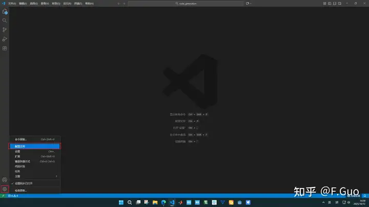

# 嵌入式 IDE 推荐：VSCode 全流程指南

> 来源：[知乎 - 怎样的一款嵌入式 IDE 才是各阶段嵌入式开发者所喜欢的?](https://www.zhihu.com/question/624233111/answer/1960763814837458820)
> 收录：2026-04-11
> 标签：嵌入式 / IDE / VSCode / STM32

---

## 核心结论

VSCode 已成为嵌入式开发的主流选择，靠的是**生态丰富、社区成熟、AI 加持**。但团队如果已有老旧 IDE，不要特立独行换工具。

---

## 一、F.Guo 的详细配置教程（63赞）

> 西南交通大学工学硕士 | 发布于 2025-10-12

### 前置软件

- VSCode
- CubeMX
- cubemxclt

### 配置步骤

#### 2.1 新建 STM32 配置

在 VSCode 左下角 → 配置文件 → 新建配置文件（改名称、换图标）→ 勾选建立的 STM32 配置。

#### 2.2 安装 STM32CubeIDE 插件

1. 搜索 `stm32cubeide`，选择 **STM32CubeIDE for Visual Studio Code**
2. 安装选项中勾选「安装预发布版本」，这样关联插件会一并安装

### 3. 调试体验

#### 3.1 CubeMX 生成底层代码

version 6.15.0 注意选择 **toolchain 为 cmake**，然后 generate code。

#### 3.2 VSCode 中 Build 工程

1. 打开工程文件夹，选择 debug
2. 右下角提示 cmake 工程配置为 stm32cube 工程，确认
3. 点击左下角生成齿轮，开始 build，最后生成 .elf 文件
4. 右键 .map 文件，选择 memory analysis，可直观看到内存占用

#### 3.3 调试功能

- 将 PCB 板通过 ST-Link 连接至电脑
- 选择"stlink gdb server"
- 可设断点、查看寄存器值、监视变量
- **注意**：全速运行时监视变量会显示"不可用"，因为 Cortex-M 调试架构在运行时不读内存
  - 想看实时值：用 **SWO / RTT / 定时采样**把数据流出来

### 4. 个人感受总结

| 方面 | 内容 |
|------|------|
| **优势** | 暗黑模式护眼、AI 插件提升编码效率、查找解决错误方便 |
| **不足** | cmake 的工程文件管理不方便，添加 .c/.h 需要手动改 CMakeLists.txt |
| **整体** | 安装配置丝滑，调试功能和 KEIL 差不多 |

---

## 二、Weyne Chen 的观点（7赞）

> 知道的越多，懂得的越少

### VSCode 的定位

严格来说 VSCode 只是编辑器，但随着**微软推广 + 插件生态 + 芯片厂商跟进**，已经基本做到 all in one。

### 不同阶段的开发者怎么看

**初学者：**
遇到问题需要调设置时，VSCode 的**社区资料成熟度**可以避免这个问题——想要的设置基本都能搜到。

**已入行的开发者：**
快速编码、格式化、版本管理这些问题 VSCode 都能解决，AI 加持下开发效率成倍提升。

**成熟开发者：**
架构、设计思路、多编程语言、多平台的问题，VSCode 都能胜任。**Markdown 加持下文档编写不是问题**，换个插件就能支持其他语言，软件本身就跨平台。

### ⚠️ 特别提醒

如果团队都使用一款**老旧 IDE**，不要特立独行切换。团队的沟通成本、效率损失远大于先进编辑器带来的价值。

---

## 三、嵌入式Linux 的观点（5赞）

1. **一定要快** — VSCode 插件多了容易卡，Source Insight 有时会闪退，Notepad++ 很多人觉得不卡
2. **函数跳转是基础功能** — Linux 内核代码同一函数在不同平台都有实现，IDE 要能处理这个问题
3. **界面好看** — 注释和代码好看，绝对让写代码更舒服

---

## 总结对比

| IDE | 优势 | 劣势 | 推荐阶段 |
|-----|------|------|---------|
| **VSCode + CubeMX** | 生态好、AI 强、跨平台、资料多 | cmake 管理不方便 | 初学～成熟 |
| **KEIL** | 传统、配套成熟 | 界面老、智能化差 | 老项目 |
| **Source Insight** | 函数跳转强、打开大文件快 | 会闪退、卡 | 看代码为主 |
